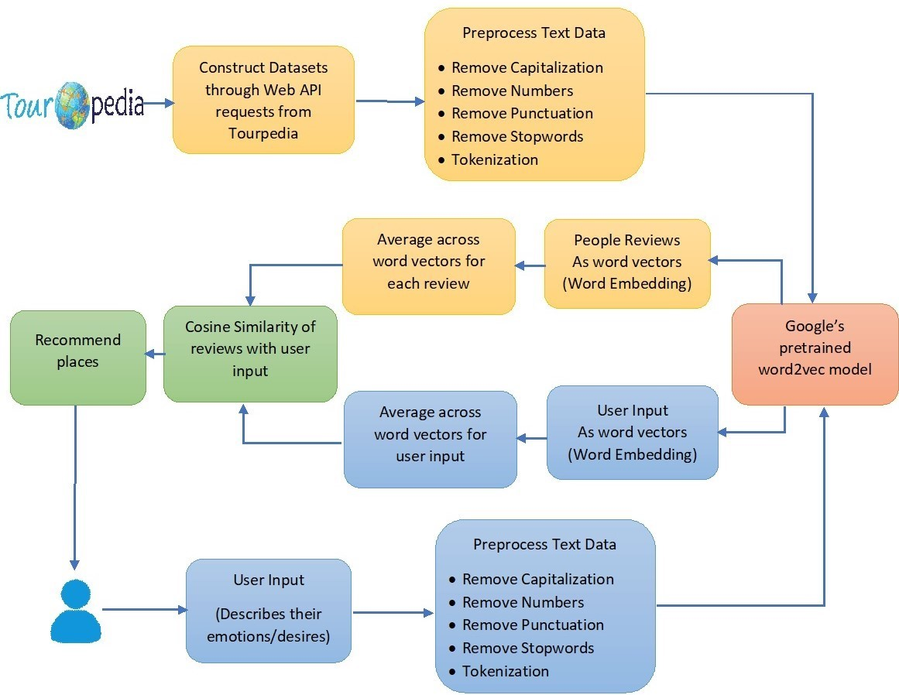

# A point of interest personalized recommendation system using Natural Language Processing (NLP)

## Project Description:
The user enters a few words to describe their emotions/desires.
 The model analyses other people reviews using and recommends the places that best align with the user's interests.

## Dataset:
List of **Places** and the **User Reviews** for various cities from the Tourpedia dataset accessible via Web API.
 **Tourpedia** contains information about points of interest and attractions of different places in Europe (London, Amsterdam, Barcelona, Berlin, Dubai, Paris, Rome and Tuscany). Data are extracted from four social media: Facebook, Foursquare, Google Places and Booking. 
  http://tour-pedia.org/about/index.html

## End-to-End Pipeline:

## Steps:

### Construct Datasets:

* Load the "Places" data as a JSON response making an API request.
* Convert the JSON into pandas dataframe and store it as a CSV file.
* For each place, load the "User Reviews" data making API requests and store it as a CSV file.

### Preprocess Data:

* Select only the relevant columns.
* Remove non-english review rows from the Reviews dataset.
* Remove Numbers, Punctuation, Stopwords, Tokenization

### Load Model:

* Load Google's pretrained word2vec model using gensim.
* Construct Word vectors for people reviews & the user input.

### Recommendation system:

* Average across the word vectors for each review and also the user input.
* Calculate Cosine Similarity between the review vectors and the user input.
* Recommend the places which have most number of reviews closest to the user input.

